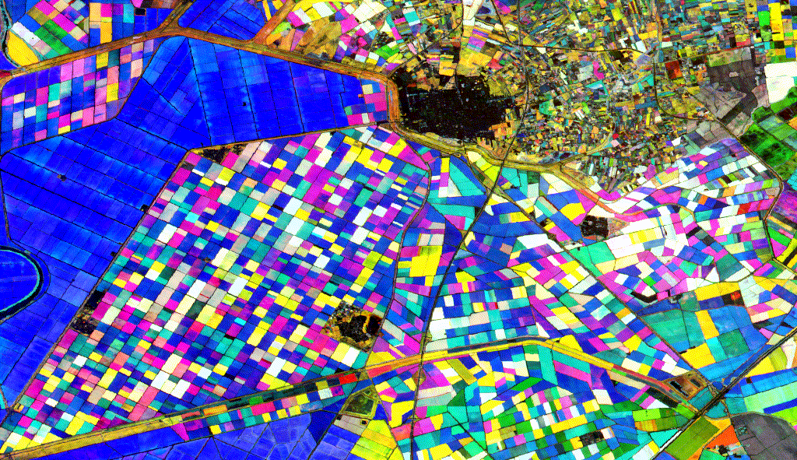

## Multi Seasonal NDVI to GIF

ndvi2gif is a python script for creating seasonal NDVI compositions gifs. This is just a small python class that uses [Google Earh Engine API](https://github.com/google/earthengine-api) and the amazing [Geemap package](https://github.com/giswqs/geemap), to create yearly compositions based on the maximun [NDVI](https://en.wikipedia.org/wiki/Normalized_difference_vegetation_index) value reached in every seasons. Maximun NDVI is used to avoid clouds and cloud shadows.  
So, we will have a raster with 4 bands (Winter, Spring, Summer and Autumn) for every year in the choosen time period. Right now, satellite collections available are Sentinel (2-MSI) and Landsat (4-TM, 5-TM, 7-ETM+ and 8-OLI). In first case you have data to play with from 2015 until the present, and in the second case, from 1984 until present. Landsat collections datasets are Surface Reflectance (SR), while Sentinel 2 is Top of Atmosphere Reflectance (TOA) dataset. This is because Surface Reflectance for Sentinel 2 data, is only available since 2017.

If everything runs well, you should get a GIF similar to those ones that you can find in the pics folder of this repo. Actually, you will get 2 gifs, one of them named "mygif_texted.gif", which add year as text to the gif. Here you can see an example close to Seville, where you can tell the blue colors (blue band in this example is summer) showing paddy fields over a marsh area (summer crops). Outside the marshes, the colors green and yellow predominate,showing winter crops such as cereals. You can also realize the intermediate colors for different crops.



Beyond the nice gif, a lot of information can be obtained with this kind of multi seasonal NDVI approach. Knowing the pair NDVI season-Raster band that you chose for your gif, and having color formation in mind (graphic below), you could tell which is the phenology, and therfore the crop or every parcel, and even how it changes through the years.  White colors means high NDVI values for the three choosen seasons (perennial vegetation), black color means low NDVI values, such as permanent water bodies, sand, impervous surfaces, etc...

<p align="center"> 

</p>

Last, you have the choice to download the yearly ndvi composites ias tiff files into your computer, in case you want the data for further analysis.  

### Installation

This tiny and humble python class depends on geemap, so geemap will be installed for you. As you can see in [geemap install](https://github.com/giswqs/geemap#installation), it could be a good idea to create a python enviroment and do the install on it. Install can be done with [pip](https://pip.pypa.io/en/stable/):

```bash
pip install ndvi2gif
```

### Usage

This is intend to be executed in a notebook and in tandem with a geemap Map object, so you could travel around the map and pick up your region of interest just by drawing a shape, and visualizing different dates and band combinations directly on the map. However, you could just run it in a command line and pass it a shapefile or a geojson as roi, and ask for the gif or for the geotiff rasters.

See the [example notebook](./ndvi2gif/ndvi2gif_notebook_example.ipynb) in this repo.

```python
#Imports libraries
import ee
import geemap
from ndvi2gif import NdviSeasonality

#You could need a first login to sart with python Earth Enginelogin 
ee.Initialize()

#Create the Map Object to choose he rois
Map = geemap.Map()
Map.add_basemap('Google Satellite')
Map

#Set the roi to last drawn feature
roi = Map.draw_last_feature

#Instance ndvi2gif
myclass = NdviSeasonality(roi)

#Maybe you feel like playing with the Map and see different colour/season combination efore generate the gif
vizParams = {'bands': ['summer', 'autumn', 'winter'], 'min': 0, 'max': 0.7, 'gamma': [0.95, 1.1, 1]}
Map.addLayer(show, vizParams, 'mycropsfirstviz')

#Notice that you also can use the Earh Engine amazing analysis capabilities
wintermax = myclass.get_year_composite().select('winter').max()
median = myclass.get_year_composite().median()
Map.addLayer(wintermax, {'min': 0, 'max': 0.75}, 'winterMax')
Map.addLayer(median, {'min': 0.1, 'max': 0.8}, 'median')

#To get the gif, ust use the method. 
myclass.get_gif()

#Last, you can export your yearly seasonal NDVI composites to your computer
myclass.get_export() 
```

### ToDo list

* Add masking capablities based on NDVI values to show real color composite in the background. Is it that possible?
* Add MODIS dataset
* Add seasons dates as parameters that can be easily modified


## Conrtibutions

Yes, please! git pulls will be welcome, even those related to my english grammar... 


## License

[MIT](https://choosealicense.com/licenses/mit/)
