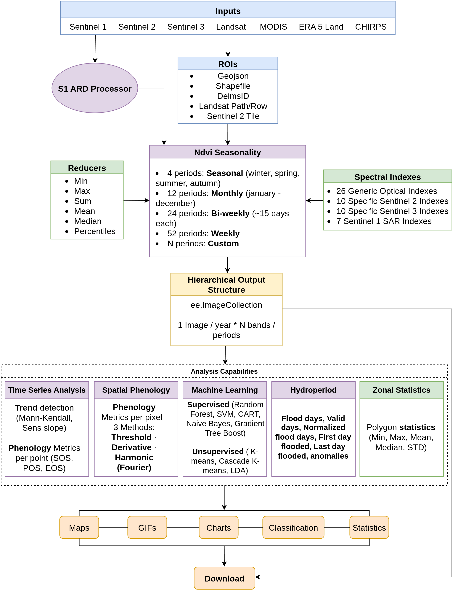

# Summary

Google Earth Engine (GEE) is a cloud-based platform for planetary-scale geospatial analysis [@Gorelick2017]. Ndvi2Gif is a Python package built on top of GEE and geemap [@Wu2020] that simplifies the generation and analysis of multi-temporal composite images from satellite and climate reanalysis data. The package provides unified access to 7 satellite platforms (Sentinel-1/2/3, Landsat 4–9, MODIS) and climate reanalysis data (ERA5-Land, CHIRPS), with 53 predefined spectral and radar indices plus 48 climate variables. Beyond compositing, the package includes modules for SAR preprocessing, time series and phenology analysis, land cover classification, and hydroperiod analysis of surface water dynamics.

The core idea behind Ndvi2Gif is the **multi-seasonal statistical composite**. Instead of handling the thousands of individual scenes a satellite records over an area, the user obtains a compact summary in which each year is represented by a fixed set of seasonal or monthly snapshots (for example, one image per month). Each snapshot condenses all the observations in that period into a single representative value —such as the median, maximum, or a chosen percentile— which suppresses clouds and data gaps. This makes long-term comparisons across the chosen temporal windows straightforward: one can, for example, map changes in the maximum flooded area each winter over several decades, track how the timing of vegetation green-up shifts from year to year, or follow the annual evolution of burned area —anywhere on the planet. Summary statistics for user-defined areas, such as field plots or protected sites, can also be extracted directly, leaving the results ready to analyse without further GIS processing.

# Statement of need

Generating multi-temporal composites in GEE requires 30–40 lines of boilerplate per sensor for collection filtering, cloud masking, scaling to reflectance, and temporal aggregation. Using Ndvi2Gif, this reduces to:

```python
from ndvi2gif import NdviSeasonality

ndvi = NdviSeasonality(roi=roi, start_year=2013, end_year=2013,
                       sat='Landsat', index='ndvi', periods=4)
collection = ndvi.get_year_composite()
```

This simplification extends across 7 satellite platforms, 53 spectral and radar indices, 48 climate variables, multiple temporal aggregation methods, and flexible region of interest specifications—all through a unified API that inherits geemap's interactive mapping capabilities. The architectural decisions and design philosophy that enable this simplification are detailed in the sections below. \autoref{fig:workflow} provides an overview of the package's workflow and capabilities.

{ width=95% }

# State of the Field

Remote sensing analysis using Google Earth Engine (GEE) has been widely facilitated by several Python-based libraries. Packages such as **geemap** [@Wu2020] provide interactive mapping and user-friendly access to Earth Engine data, while **eemont** [@Montero2021] focuses on preprocessing utilities and spectral index computation while preserving the native `ee.ImageCollection` temporal structure. **Wxee** [@Zuspan2021] emphasizes interoperability with the scientific Python ecosystem by exporting Earth Engine data into xarray objects for sequential time series analysis.

While these tools significantly lower the entry barrier to GEE, they are primarily designed as general-purpose interfaces or extensible utility layers. As a result, researchers conducting long-term ecological or phenological studies often need to implement substantial custom code to ensure consistent temporal alignment, multi-seasonal comparability, and reproducibility across decades of observations.

Ndvi2Gif addresses this gap by adopting a distinct design philosophy centered on **band-based temporal organization**, where each image represents a temporal unit (typically a year) and bands encode fixed intra-annual periods (e.g., months or seasons). This approach enables direct multi-decadal queries across consistent seasonal windows, which is difficult to achieve efficiently using the native collection-based paradigm.

Contributing this functionality to existing packages would require fundamental changes to their core temporal abstractions and design goals. Ndvi2Gif therefore complements, rather than replaces, existing GEE Python tools by providing a specialized framework tailored to multi-seasonal ecological analysis, phenology validation, and operational environmental monitoring.

# Key features

## Multi-platform data access

Ndvi2Gif provides unified access to optical, SAR, and climate reanalysis datasets through a consistent interface (\autoref{tab:datasets}).

: Supported satellite and reanalysis datasets. \label{tab:datasets}

| Platform   | Collection       | Resolution | Coverage     | Variables        |
| :--------- | :--------------- | :--------- | :----------- | :--------------- |
| Sentinel-2 | S2 SR HARMONIZED | 10/20m     | 2015–present | 36 optical       |
| Sentinel-3 | OLCI             | 300m       | 2016–present | 36 optical       |
| Landsat    | L4–L9 Col. 2     | 30m        | 1982–present | 27 optical       |
| MODIS      | Terra/Aqua       | 500m       | 2000–present | 27 optical       |
| Sentinel-1 | GRD ARD          | 10m        | 2014–present | 7 SAR            |
| ERA5-Land  | Hourly/Monthly   | 11km       | 1950–present | 47 climate       |
| CHIRPS     | Daily            | 5.5km      | 1981–present | Precipitation    |

26 optical indices are available across all optical sensors. Sentinel-2 adds 9 Red-Edge indices and 1 SWIR index (36 total); Sentinel-3 adds 10 water quality indices (36 total); Landsat and MODIS add 1 SWIR index (27 total). SAR indices are exclusive to Sentinel-1.

## Flexible region of interest

The library supports multiple ROI specification formats, enabling seamless integration with existing workflows and the eLTER research network [@Wohner2019].

: Supported region of interest formats. \label{tab:roi}

| Format      | Example                 | Description              |
| :---------- | :---------------------- | :----------------------- |
| Shapefile   | `'study_area.shp'`      | Local vector file        |
| GeoJSON     | `'boundaries.geojson'`  | GeoJSON file             |
| DEIMS ID    | `'deimsid:8eda49e9...'` | eLTER site               |
| S2 tile     | `'s2:29SQB'`            | MGRS tile code           |
| Landsat WRS | `'wrs:200,32'`          | Path and Row             |
| ee.Geometry | `ee.Geometry.Point()`   | GEE geometry             |
| geemap      | `Map.draw_features`     | Interactive selection    |

## Advanced SAR processing

The `S1ARDProcessor` module implements a complete Analysis Ready Data (ARD) pipeline for Sentinel-1 imagery, based on Vollrath et al. [-@Vollrath2020]. This addresses a critical limitation of the default Sentinel-1 products available in Google Earth Engine, which do not include radiometric terrain correction or advanced speckle filtering.

The ARD workflow includes:

* **Radiometric terrain correction** using an angular-based approach with configurable digital elevation models (Copernicus and SRTM), essential for reducing topographic effects in mountainous or heterogeneous terrain.
* **Speckle filtering** using multiple algorithms (Refined Lee, Lee, Gamma MAP, Lee Sigma, Boxcar), allowing users to balance noise reduction and edge preservation depending on the application.
* **Scattering model selection**, supporting both volume scattering (vegetation-dominated surfaces) and surface scattering (bare soil or water).

This preprocessing enables the reliable use of SAR-derived indices for vegetation structure monitoring, surface moisture assessment, and land cover analysis in areas where optical data are limited by cloud cover.

## Time series and phenology analysis

The `TimeSeriesAnalyzer` module extracts, analyses, and visualises temporal dynamics from multi-seasonal composite stacks, operating on temporally aligned bands within each yearly image to ensure consistency across years and reduce sensitivity to irregular acquisition frequency.

The module supports:

* **Trend detection and significance testing**, including non-parametric Mann–Kendall tests, Sen's slope estimation, and linear regression with confidence intervals.
* **Phenological metrics extraction**, such as Start of Season (SOS), End of Season (EOS), Peak of Season (POS), season length, amplitude, and growth and senescence rates, derived from smoothed seasonal trajectories.
* **Seasonal and interannual comparison**, enabling direct assessment of variability and long-term change across fixed temporal windows.
* **Integrated visual diagnostics**, producing multi-panel dashboards that combine time series plots, seasonal distributions, trend summaries, autocorrelation, and data quality indicators.

This design allows researchers to move seamlessly from data extraction to exploratory and quantitative temporal analysis within a single, reproducible workflow, and is particularly suited to long-term ecological monitoring, phenology validation, and climate–vegetation interaction studies.

Complementing this point- and region-based analysis, the `SpatialPhenologyAnalyzer` module computes per-pixel phenological rasters (SOS, POS, EOS, season length, amplitude, and growth and senescence rates) across the entire region of interest, running entirely server-side on Google Earth Engine. In addition to threshold- and derivative-based extraction, it provides a per-pixel harmonic (Fourier) regression that reconstructs a smooth seasonal trajectory, offering a scalable, Earth Engine-native alternative to double-logistic curve fitting. Results can be returned as one map per year or as a multi-year aggregate, enabling spatially explicit phenology mapping and validation over large areas.

## Machine learning classification

The `LandCoverClassifier` module provides supervised and unsupervised land cover classification workflows based on multi-temporal composite stacks generated by `NdviSeasonality`. Supported supervised algorithms include Random Forest, Support Vector Machines (SVM), CART, Naive Bayes, and Gradient Tree Boost, while unsupervised approaches include K-means and Cascade K-means clustering.

The module supports feature stack generation from multi-seasonal indices, optional normalization, training and validation dataset handling, and accuracy assessment through confusion matrices and standard performance metrics. Feature importance analysis is also available for supervised classifiers, enabling interpretation of which temporal periods or indices contribute most strongly to classification results.

## Hydroperiod analysis

The `HydroperiodAnalyzer` module computes surface water dynamics and flooding metrics from multi-temporal optical composites. Working directly on `NdviSeasonality` outputs, it derives pixel-level hydroperiod statistics without requiring external hydrological data.

The module computes:

* **Flood days** — total number of days classified as flooded within a period
* **Valid days** — observation count after cloud masking, enabling data quality assessment
* **Normalized flood days** — flood days relative to valid observations, correcting for gaps in coverage
* **First and last day flooded** — timing metrics for flood onset and recession
* **Anomalies** — deviation from the long-term mean hydroperiod, useful for detecting exceptional flood or drought years. The reference mean can be computed either from the years selected in the analysis or from all available cycles in the chosen dataset, giving users control over the baseline period

By default, hydrological cycles run from 1 September to 31 August, following the standard hydrological year convention, but the cycle boundaries are fully configurable to accommodate other definitions (e.g., calendar year, wet season onset).

This functionality is particularly suited to Mediterranean wetlands and seasonally inundated ecosystems where surface water dynamics are highly variable and cloud cover frequently limits optical observation.

# Software Design

Ndvi2Gif preserves the native `ee.ImageCollection` abstraction but implements a **hierarchical band-based approach**: each collection element corresponds to a year, and bands encode fixed intra-annual sub-periods (months, biweekly intervals, or seasons). A 40-year monthly analysis produces 40 images with 12 bands each, rather than 480 individual images.

This design enables queries such as: *What is the mean cyanobacteria index (NDCI) detected from Sentinel-2 during August across the last 10 years?* by simply calling `collection.select('august').mean()`, or *In which week of the year does chlorophyll detected from Sentinel-3 peak?* by computing `collection.max().bandNames()`.

This architecture trades increased per-image band dimensionality for drastically simpler, more reproducible seasonal queries. This trade-off is well suited to long-term ecological and phenological analysis, but less appropriate for applications focused on high-frequency pixel-level forecasting.

Beyond temporal organization, ndvi2gif integrates complete Sentinel-1 ARD preprocessing, automated phenology metrics extraction, land cover classification, zonal statistics, and geemap-based visualization within a unified API.

# Research Impact Statement

Ndvi2Gif has demonstrated realized research impact through peer-reviewed publications, operational research infrastructure, and downstream software integration since its initial release in May 2020. The package has been applied in calibration and validation studies of Earth Observation products for phenology and surface water monitoring at the Doñana protected area [@DiazDelgado2024].

Ndvi2Gif serves as a foundational component of *geeltermap*, a Python mapping application providing operational environmental monitoring tools for the eLTER network [@DiazDelgado2024b]. Geeltermap integrates PhenoApp for phenology monitoring [@Garcia2023], FloodApp for flood extent analysis, and LSTApp for land surface temperature assessment.

The package is currently used as a core analytical tool in the eLTER network infrastructure and the SUMHAL biodiversity monitoring initiative in Spanish protected areas, demonstrating readiness for reproducible multi-temporal remote sensing analysis.

# AI Usage Disclosure

Ndvi2Gif was initially developed in May 2020 and underwent sustained development through 2024 before current-generation AI coding assistants became widely available. The core scientific methodology, architectural design decisions, and algorithmic implementations represent the author's original intellectual contributions. AI tools are currently used as development assistants for refactoring, documentation, debugging, and test implementation, while all strategic decisions regarding software architecture and scientific approach remain under the author's direction.

# Acknowledgements

The author thanks the Google Earth Engine team and community, and especially acknowledges Qiusheng Wu for geemap, which serves as the primary foundation of Ndvi2Gif, and for his continued contributions to open-source geospatial software.

# References
